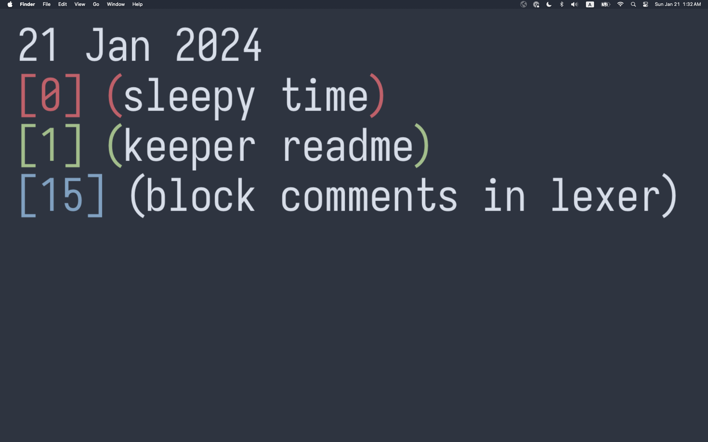

# keeper
A terminal-operated todo list that **renders to your wallwapper!**

## Installation
```
1. git clone https://github.com/fprasx/keeper
2. just init
3. just install keeper-todo
```

Note: you'll need `fd` and `just` installed. You can install both through cargo.
Alternatively, it's easy enough to just patch the code to use find and to run
the init steps manually.

I'm calling the todo list `keeper-todo` as I might add other `keeper-` projects
in the future.

## Usage
keeper works at 1-hour granularity. Tasks that are overdue will turn red, tasks
that are complete will turn green, and tasks that are not due and not complete
will be blue.

Whenever you update your todo list, the your wallpaper will automatically rerender
to reflect the new state.



All operations are performed through the CLI. I recommend adding some snippets to
your shell configuration.

```
keeper-todo (3f9f88) Felix Prasanna 2024
help:
    keeper-todo help
add:
    keeper-todo add date hour desc
mark:
    keeper-todo mark date hour.index
    keeper-todo mark date hour
change:
    keeper-todo change date hour.index new-hour
    keeper-todo change date hour new-hour
show:
    keeper-todo show date
    keeper-todo show count
    keeper-todo show
render:
    keeper-todo render date path
    keeper-todo render count path

terms:
    date = (dd-mm-yy|today|tomorrow|yesterday)
```

## Why?
Because I amortize my procrastination time by working on things that will
allegedly make me more productive. Plus engineers love to overengineer things.
We should really just be called overnegineers.

## Caveats

Currently, rendering only works on MacOS. Additionally, some of the constants are
tailored to my system. However, if you a Mac, all you have to recalculate them.
You'll probably only need to change `SCREEN_HEIGHT` and `SCREEN_WIDTH` to the
pixel values you get from taking the largest screenshot possible on your machine.

## License

Licensed under the GPL v3.0 or later.

Copyright 2024-present Felix Prasanna

"present" is the time given by some atomic clock. If you have an atomic clock I
defer to your judgement.
